alternative_simulation
================

``` r
library(irregMFPCA)
library(tidyverse)
library(fda)
library(fdapace)
library(MFPCA)
set.seed(16)
```

## Function to Normalize Eigenscores

``` r
normalizer = function(mat, normal = NULL){
  if(is.null(normal)){normal = nrow(mat)}
  
  lmat = as.list(data.frame(mat))
  constants = sqrt(normal/sapply(lmat, function(x) sum(x^2)))
  
  return(matrix(c(constants[1]*mat[, 1],
                  constants[2]*mat[, 2],
                  constants[3]*mat[, 3]), 
                nrow = nrow(mat),
                ncol = ncol(mat)))
}
```

## Generate Mean Functions

$$
\mu_{X_1}(t) = -2(t-0.5)^2 + 5 \text{ for }t \in [0,1]
$$

$$
\mu_{X_2}(t) = 3(t-0.75)^3 + 4 \text{ for }t \in [0,1]
$$

``` r
TT = 100
t = seq(0, 1, length.out = TT)
mu_X1 = -2*(t-0.5)^2 + 5
mu_X2 = 3*(t-0.75)^3 + 4
```

## Generate Eigenfunctions and Eigenscores

$$
\phi^{X_1}_1(t) = \sqrt{2}\sin(\pi t), \ \phi^{X_1}_2(t) = \sqrt{2}\sin(7\pi t), \ \phi^{X_1}_3(t) = \sqrt{2}\cos(7\pi t) 
$$

$$
\phi^{X_2}_1(t) = \sqrt{2}\cos(5\pi t), \ \phi^{X_2}_2(t) = \sqrt{2}\cos(\pi t), \ \phi^{X_2}_3(t) = \sqrt{2}\sin(7\pi t) 
$$

``` r
# phi_X1 = matrix(0, nrow = TT, ncol = 3)
# phi_X1[,1] = sqrt(2/TT)*sin(pi*t)
# phi_X1[,2] = sqrt(2/TT)*sin(2*pi*t)
# phi_X1[,3] = sqrt(2/TT)*cos(4*pi*t)

phi_X1 = matrix(0, nrow = TT, ncol = 3)
phi_X1[,1] = sin(pi*t)
phi_X1[,2] = sin(2*pi*t)
phi_X1[,3] = cos(4*pi*t)

# new_phi_X1 = normalizer(new_phi_X1)

phi_X1 = normalizer(phi_X1)

n = 99;
lambda11 = 4; lambda21 = 1; lambda31 = .1
xi_X1 = matrix(0, nrow = n, ncol = 3)
xi_X1[,1] = rnorm(n, 0, lambda11)
xi_X1[,2] = rnorm(n, 0, lambda21)
xi_X1[,3] = rnorm(n, 0, lambda31)

xi_X1 = normalizer(xi_X1)

X1 = t(phi_X1 %*% t(xi_X1)) + rep(1, n) %*% t(mu_X1)

phi_X1 %>%
  as.data.frame() %>%
  ggplot(aes(x = t)) +
  geom_line(aes(y = V1), col = "red") +
  geom_line(aes(y = V2), col = "blue") +
  geom_line(aes(y = V3), col = "green") +
  theme_bw()
```

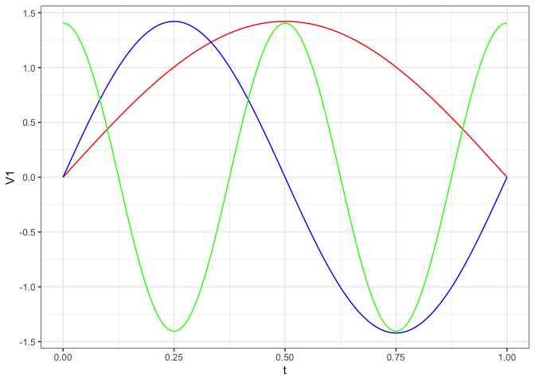<!-- -->

``` r

plot(mu_X1)
```

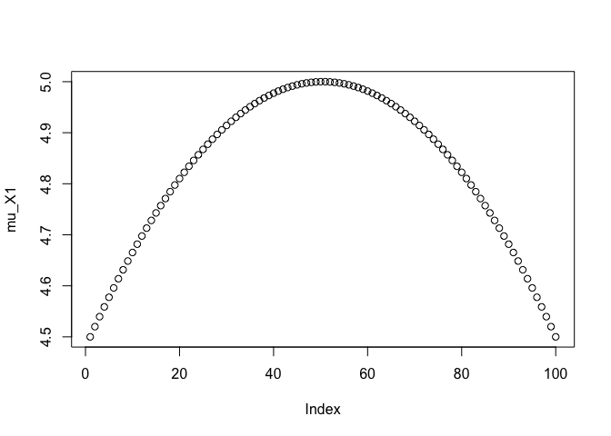<!-- -->

``` r

phi_X2 = matrix(0, nrow = TT, ncol = 3)
phi_X2[,1] = cos(3*pi*t)
phi_X2[,2] = cos(pi*t)
phi_X2[,3] = sin(5*pi*t)

phi_X2 = normalizer(phi_X2)

# lambda12 = 2; lambda22 = 20; lambda32 = 50
# xi_X2 = matrix(0, nrow = n, ncol = 3)
# xi_X2[,1] = rnorm(n, 0, lambda12)
# xi_X2[,2] = rnorm(n, 0, lambda22)
# xi_X2[,3] = rnorm(n, 0, lambda32)

X2 = t(phi_X2 %*% t(xi_X1)) + rep(1, n) %*% t(mu_X2)

phi_X2 %>%
  as.data.frame() %>%
  ggplot(aes(x = t)) +
  geom_line(aes(y = V1), col = "red") +
  geom_line(aes(y = V2), col = "blue") +
  geom_line(aes(y = V3), col = "green") +
  theme_bw()
```

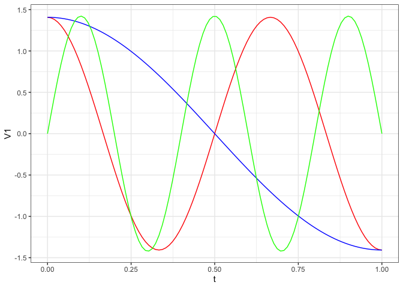<!-- -->

``` r

plot(mu_X2)
```

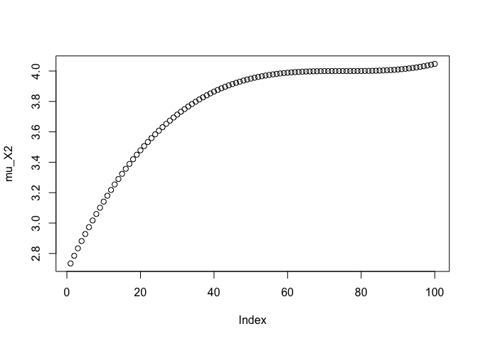<!-- -->

``` r
# V = normalizer(phi_X1)
# 
# t(V) %*% V / 100
```

## Generate Response

$$
\mu_{Y_1}(t) = 6\exp(-(t-1)^2)
$$

$$
\mu_{Y_2}(t) = 2\cdot 14^{(t-0.5)}
$$

$$
\phi^{Y_1}_1(t) = \sqrt{2}\cos(9\pi t), \ \phi^{Y_1}_2(t) = \sqrt{2}\sin(5\pi t), \ \phi^{Y_1}_3(t) = \sqrt{2}\cos(2\pi t)
$$

$$
\phi^{Y_2}_1(t) = \sqrt{2}\sin(3\pi t), \ \phi^{Y_2}_2(t) = \sqrt{2}\cos(\pi t), \ \phi^{Y_2}_3(t) = \sqrt{2}\sin(7\pi t)
$$

``` r
mu_Y1 = 6*exp(-(t-1)^2)
mu_Y2 = 2*14^(t-0.5)

phi_Y1 = matrix(0, nrow = TT, ncol = 3)
phi_Y1[,1] = sqrt(2/TT)*cos(9*pi*t)
phi_Y1[,2] = sqrt(2/TT)*sin(5*pi*t)
phi_Y1[,3] = sqrt(2/TT)*cos(2*pi*t)

phi_Y1 = normalizer(phi_Y1)

phi_Y1 %>%
  as.data.frame() %>%
  ggplot(aes(x = t)) +
  geom_line(aes(y = V1), col = "red") +
  geom_line(aes(y = V2), col = "blue") +
  geom_line(aes(y = V3), col = "green") +
  theme_bw()
```

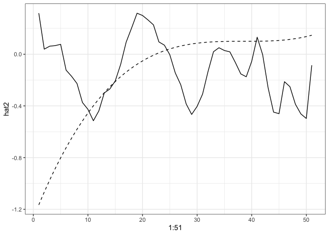<!-- -->

``` r

plot(mu_Y1)
```

<!-- -->

``` r

xi_Y1 = matrix(0, nrow = n, ncol = 3)
xi_Y1[,1] = rnorm(n, 0, lambda11)
xi_Y1[,2] = rnorm(n, 0, lambda21)
xi_Y1[,3] = rnorm(n, 0, lambda31)

xi_Y1 = normalizer(xi_Y1)


phi_Y2 = matrix(0, nrow = TT, ncol = 3)
phi_Y2[,1] = sqrt(2/TT)*sin(3*pi*t)
phi_Y2[,2] = sqrt(2/TT)*cos(pi*t)
phi_Y2[,3] = sqrt(2/TT)*sin(7*pi*t)

phi_Y2 = normalizer(phi_Y2)

phi_Y2 %>%
  as.data.frame() %>%
  ggplot(aes(x = t)) +
  geom_line(aes(y = V1), col = "red") +
  geom_line(aes(y = V2), col = "blue") +
  geom_line(aes(y = V3), col = "green") +
  theme_bw()
```

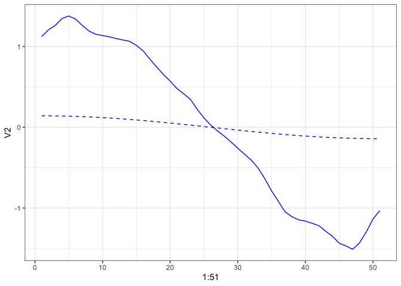<!-- -->

``` r

plot(mu_Y2)
```

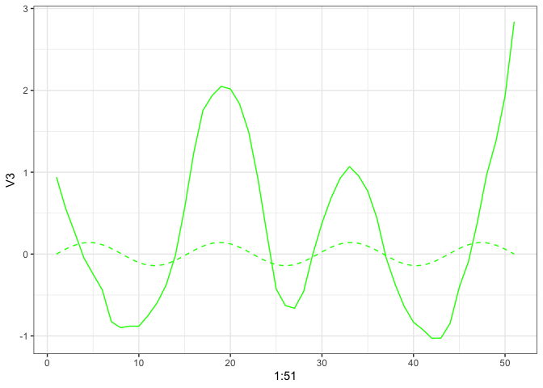<!-- -->

``` r

# xi_Y2 = matrix(0, nrow = n, ncol = 3)
# xi_Y2[,1] = rnorm(n, 0, lambda12)
# xi_Y2[,2] = rnorm(n, 0, lambda22)
# xi_Y2[,3] = rnorm(n, 0, lambda32)
```

## Combine Components

``` r
X = cbind(X1, X2)
phi_X = cbind(phi_X1, phi_X2)
# xi_X = cbind(xi_X1, xi_X2)

phi_Y = cbind(phi_Y1, phi_Y2)
# xi_Y = cbind(xi_Y1, xi_Y2)
mu_Y = c(mu_Y1, mu_Y2)
```

## Noise

``` r
sigma = 0.1
n_eig_X = 3
n_eig_Y = 3
```

## Regression

``` r
# Generate B matrix from Unif(-U, U)
# U = 3
# B = matrix(sample(seq(-U, U, 0.01),n_eig_X*n_eig_Y),
#            nrow = n_eig_Y,
#            ncol = n_eig_X)

# sample(-9:9, 9, replace = T)
B = matrix(c(-1, 2, 3, -1, -9, 3, 5, 5, -3),
           nrow = n_eig_Y,
           ncol = n_eig_X)

# epsilon = matrix(rnorm(n_eig_Y*n, mean = 0, sd = 0.01), 
#                  n_eig_Y, 
#                  n)

Y1 = matrix(nrow = n, 
            ncol = TT)
Y2 = matrix(nrow = n, 
            ncol = TT)
```

### Introduce Outliers (DISCARDED FOR NOW)

``` r
# outliers = 20
# non_outliers = n - outliers
# 

# This is equal to xi_X1 %*% t(B) + mu_Y1

for (i in 1:n){
  Y1[i,] = t(B%*%xi_X1[i,])%*%t(phi_Y1) + mu_Y1 # + t(phi_Y1%*%epsilon[,i])
  Y2[i,] = t(B%*%xi_X1[i,])%*%t(phi_Y2) + mu_Y2 # + t(phi_Y2%*%epsilon[,i])
}
```

## Scenarios

``` r
# scenario = 1
# 
# if (scenario==1){
#   outlier_var = 0.5
#   B_out = B + matrix(rnorm(n_eig_X*n_eig_Y, mean = 0, sd = outlier_var),
#                      nrow = n_eig_Y,
#                      ncol = n_eig_X)
#   
#   for (i in (non_outliers+1):n){
#     Y1[i,] = t(B_out%*%xi_X1[i,])%*%t(phi_Y1) + mu_Y1 + t(phi_Y1%*%epsilon[,i])
#     Y2[i,] = t(B_out%*%xi_X1[i,])%*%t(phi_Y2) + mu_Y2 + t(phi_Y2%*%epsilon[,i])
#   }
# }

# if (scenario==2){
#   gaittime = seq(0, 1, len=TT)
#   gaitrange = c(0,1)
#   nord = 10
#   gaitbasis = create.bspline.basis(c(0,1), nbasis = nord, norder = 3)
#   evaluated_basis = eval.basis(gaitbasis, gaittime)
#   normalised_basis = eval.basis(gaitbasis, gaittime)
#   
#   values = diag(inprod(gaitbasis,gaitbasis)*TT)
#   intu = sample(nord, 1)
#   
#   out_basis = normalised_basis[, intu]
#   
#   B_out = rbind(B, rnorm(3,3,1))
#   
#   for (i in (non_outliers+1):n){
#     Y[i,] = t(cbind(phi_Y, out_basis/values[intu]) %*% (B_out %*% xi_X[i,]) + mu_Y) + t(phi_Y%*%epsilon[,i])
#   }
# }
```

``` r
Y = cbind(Y1, Y2)

E = matrix(rnorm(2*TT*n, mean = 0, sd = sigma), n, 2*TT)

Y =  Y + E
```

``` r
#### plot Predictior and Response curves ####

matplot(t(X), 
        type='l', 
        ylab='X(t)', 
        xlab='time', 
        main='Plot of predictor curves', 
        col=rgb(0,0,0,alpha=0.4))
```

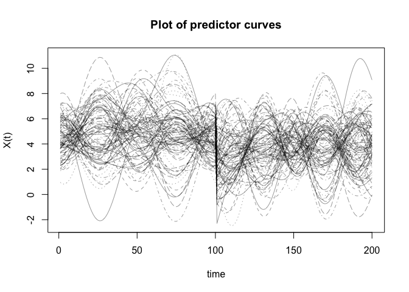<!-- -->

``` r
# matlines(t(X[(non_outliers+1):n,]), 
#          type='l', 
#          lwd=3, 
#          lty=1)

matplot(t(Y), 
        type='l', 
        ylab='Y(t)', 
        xlab='time', 
        main='Plot of response curves', 
        col=rgb(0,0,0,alpha=0.6))
```

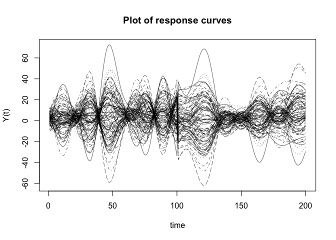<!-- -->

``` r
# matlines(t(Y[(non_outliers+1):n,]), 
#          type='l', 
#          lwd=3, 
#          lty=1)
```

### MFPCA

``` r
X_miss = irregMFPCA::missing_data_simulator(n_obs = 90,
                                            dat = X,
                                            t = seq(0, 1, length.out = TT),
                                            seed = 16)


df = X_miss %>% tibble_format(tindex = t) %>% fpca_format()
#> New names:
#> • `v` -> `v...3`
#> • `v` -> `v...4`
```

``` r
res1 = FPCA(df$Component1,
            df$Time,
            list(dataType='Sparse',
                 error=FALSE,
                 kernel='epan',
                 verbose=TRUE))
#> No binning is needed!
#> At most 30 number of PC can be selected, thresholded by `maxK` = 20.

res2 = FPCA(df$Component2,
            df$Time,
            list(dataType='Sparse',
                 error=FALSE,
                 kernel='epan',
                 verbose=TRUE))
#> No binning is needed!
#> At most 31 number of PC can be selected, thresholded by `maxK` = 20.
```

``` r
# plot(res)
```

### Compare to Actual: First Component

``` r
act = data.frame(act1 = mu_X1,
                 act2 = mu_X2)
hat = data.frame(hat1 = res1$mu,
                 hat2 = res2$mu)

hat %>%
  ggplot() +
  geom_line(aes(x = 1:51, y = hat1)) +
  geom_line(data = act, aes(x = seq(1, 51, length.out = 100), y = act1), linetype = "dashed") +
  theme_bw()
```

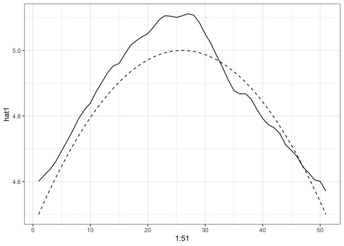<!-- -->

``` r

phi_X1_df = phi_X1 %>% as.data.frame()

res1$phi[, 1:3] %>%
  as.data.frame() %>%
  ggplot() +
  geom_line(aes(x = 1:51, y = V1), col = "red") +
  geom_line(data = phi_X1_df, aes(x = seq(1, 51, length.out = 100), y = V1), col = "red", linetype = "dashed") +
  theme_bw()
```

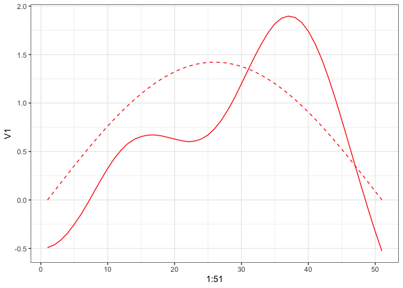<!-- -->

``` r

res1$phi[, 1:3] %>%
  as.data.frame() %>%
  ggplot() +
  geom_line(aes(x = 1:51, y = V2), col = "blue") +
  geom_line(data = phi_X1_df, aes(x = seq(1, 51, length.out = 100), y = V2), col = "blue", linetype = "dashed") +
  theme_bw()
```

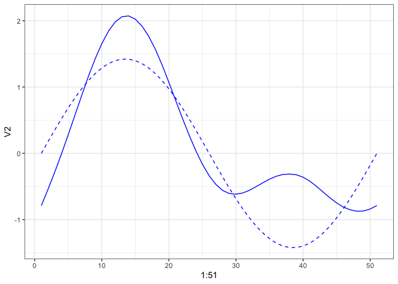<!-- -->

``` r

res1$phi[, 1:3] %>%
  as.data.frame() %>%
  ggplot() +
  geom_line(aes(x = 1:51, y = V3), col = "green") +
  geom_line(data = phi_X1_df, aes(x = seq(1, 51, length.out = 100), y = V3), col = "green", linetype = "dashed") +
  theme_bw()
```

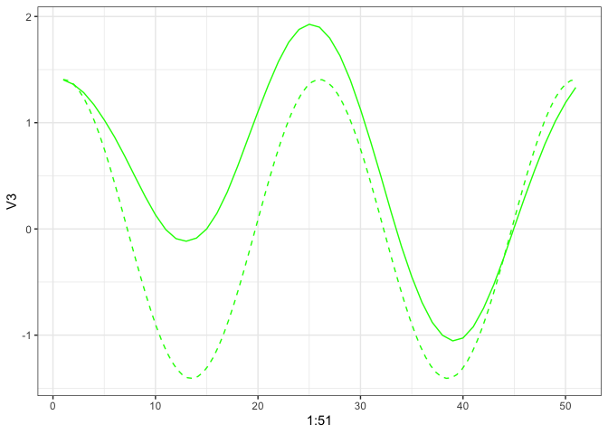<!-- -->

### Compare to Actual: Second Component

``` r
hat %>%
  ggplot() +
  geom_line(aes(x = 1:51, y = hat2)) +
  geom_line(data = act, aes(x = seq(1, 51, length.out = 100), y = act2), linetype = "dashed") +
  theme_bw()
```

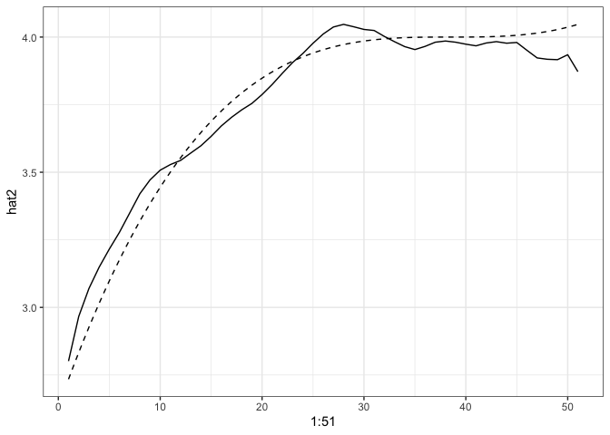<!-- -->

``` r

phi_X2_df = phi_X2 %>% as.data.frame()

res2$phi[, 1:3] %>%
  as.data.frame() %>%
  ggplot() +
  geom_line(aes(x = 1:51, y = V1), col = "red") +
  geom_line(data = phi_X2_df, aes(x = seq(1, 51, length.out = 100), y = V1), col = "red", linetype = "dashed") +
  theme_bw()
```

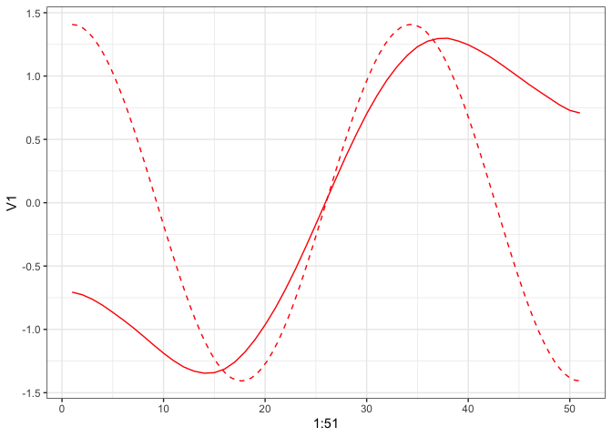<!-- -->

``` r

res2$phi[, 1:3] %>%
  as.data.frame() %>%
  ggplot() +
  geom_line(aes(x = 1:51, y = V2), col = "blue") +
  geom_line(data = phi_X2_df, aes(x = seq(1, 51, length.out = 100), y = V2), col = "blue", linetype = "dashed") +
  theme_bw()
```

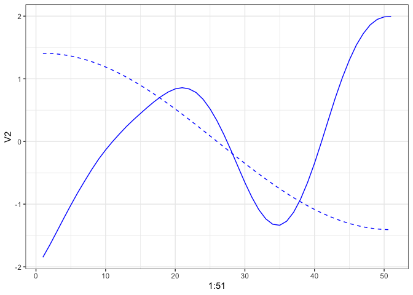<!-- -->

``` r

res2$phi[, 1:3] %>%
  as.data.frame() %>%
  ggplot() +
  geom_line(aes(x = 1:51, y = V3), col = "green") +
  geom_line(data = phi_X2_df, aes(x = seq(1, 51, length.out = 100), y = V3), col = "green", linetype = "dashed") +
  theme_bw()
```

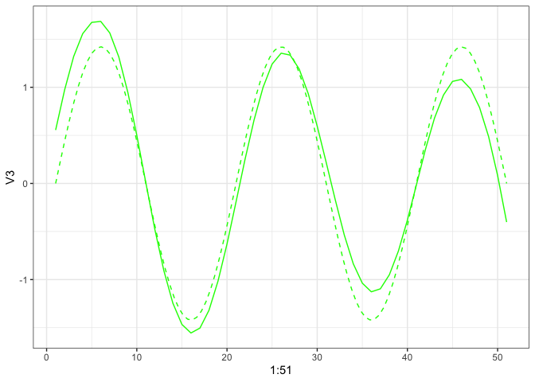<!-- -->

## Irregular MFPCA

``` r
mfpca_res = irregMFPCA::irregMFPCA(components = 3, #TODO: Ambiguous parameter name. Number of principal components to consider
                                   split = T,
                                   res1,
                                   res2)
```

### Check Results

``` r
mfpca_eigenf = mfpca_res$unstackpsi
colnames(mfpca_eigenf) = c("var_1_1", "var_1_2", "var_1_3", "var_2_1", "var_2_2", "var_2_3")
mfpca_eigens = mfpca_res$rho
colnames(mfpca_eigens) = c("function_1", "function_2", "function_3")
```

``` r
tplot = seq(0, 1, length.out = 51)
mfpca_eigenf %>%
  as.data.frame() %>%
  ggplot() +
  geom_line(aes(x = tplot, y = var_1_1), col = "red") +
  geom_line(data = phi_X1_df, aes(x = seq(0, 1, length.out = 100), y =V1), col = "black", linetype = "dotted") +
  theme_bw()
```

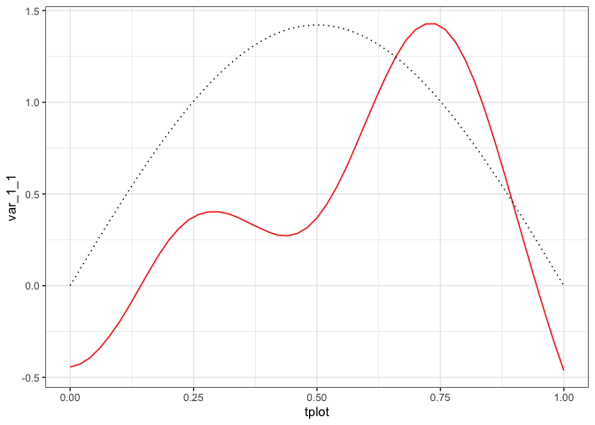<!-- -->

``` r

mfpca_eigenf %>%
  as.data.frame() %>%
  ggplot() +
  geom_line(aes(x = tplot, y = var_1_2), col = "red") +
  geom_line(data = phi_X1_df, aes(x = seq(0, 1, length.out = 100), y =V2), col = "black", linetype = "dotted") +
  theme_bw()
```

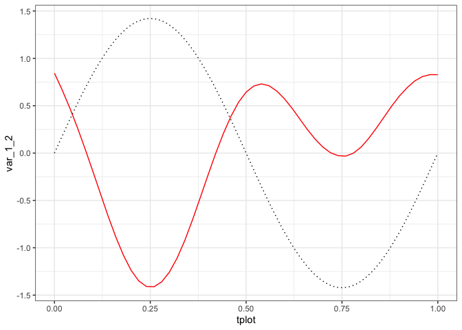<!-- -->

``` r

mfpca_eigenf %>%
  as.data.frame() %>%
  ggplot() +
  geom_line(aes(x = tplot, y = var_1_3), col = "red") +
  geom_line(data = phi_X1_df, aes(x = seq(0, 1, length.out = 100), y =V3), col = "black", linetype = "dotted") +
  theme_bw()
```

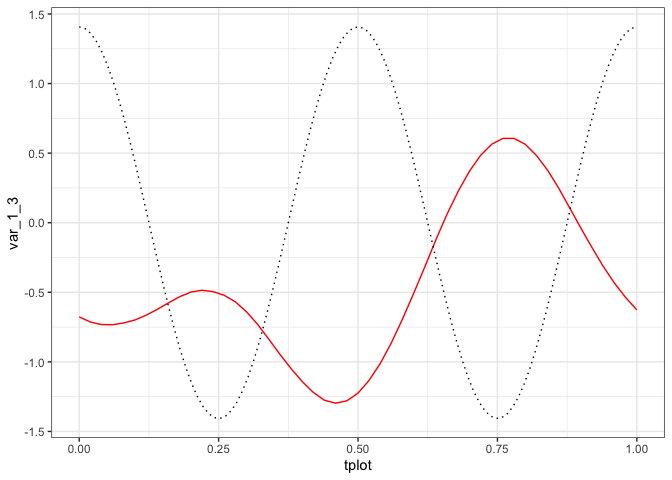<!-- -->

``` r


mfpca_eigenf %>%
  as.data.frame() %>%
  ggplot() +
  geom_line(aes(x = tplot, y = var_2_1), col = "blue") +
  geom_line(data = phi_X2_df, aes(x = seq(0, 1, length.out = 100), y =V1), col = "black", linetype = "dotted") +
  theme_bw()
```

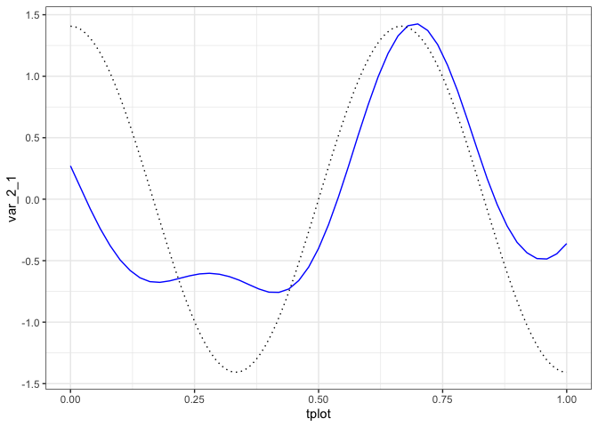<!-- -->

``` r

mfpca_eigenf %>%
  as.data.frame() %>%
  ggplot() +
  geom_line(aes(x = tplot, y = var_2_2), col = "blue") +
  geom_line(data = phi_X2_df, aes(x = seq(0, 1, length.out = 100), y =V2), col = "black", linetype = "dotted") +
  theme_bw()
```

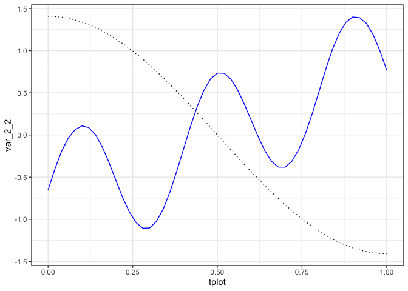<!-- -->

``` r

mfpca_eigenf %>%
  as.data.frame() %>%
  ggplot() +
  geom_line(aes(x = tplot, y = var_2_3), col = "blue") +
  geom_line(data = phi_X2_df, aes(x = seq(0, 1, length.out = 100), y =V3), col = "black", linetype = "dotted") +
  theme_bw()
```

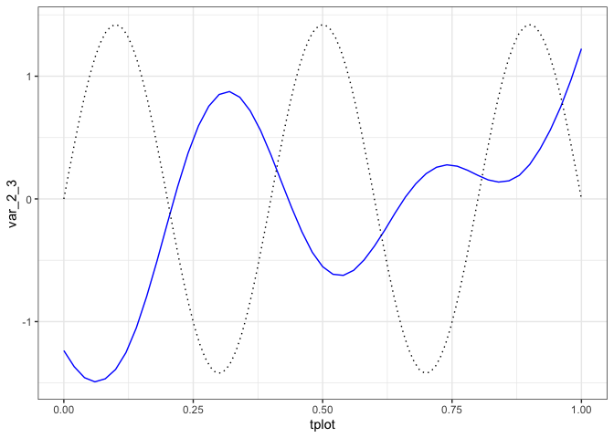<!-- -->

``` r
eigens = data.frame(est1 = -mfpca_eigens[,1],
                    est2 = -mfpca_eigens[,2],
                    est3 = -mfpca_eigens[,3],
                    act1 = xi_X1[, 1],
                    act2 = xi_X1[, 2],
                    act3 = xi_X1[, 3])

eigens %>%
  ggplot(aes(x = est1, y = act1)) +
  geom_point() +
  geom_abline(intercept = 0, slope = 1, col = "red") +
  geom_smooth(method = "lm", se = F) +
  theme_bw()
#> `geom_smooth()` using formula = 'y ~ x'
```

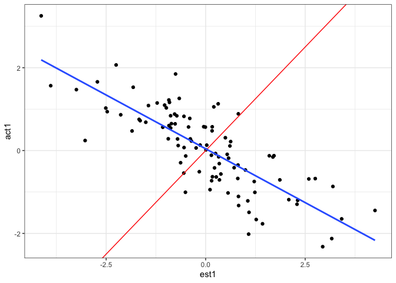<!-- -->

``` r

eigens %>%
  ggplot(aes(x = est2, y = act2)) +
  geom_point() +
  geom_abline(intercept = 0, slope = 1, col = "red") +
  geom_smooth(method = "lm", se = F) +
  theme_bw()
#> `geom_smooth()` using formula = 'y ~ x'
```

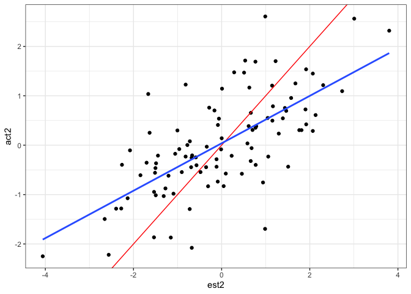<!-- -->

``` r

eigens %>%
  ggplot(aes(x = est3, y = act3)) +
  geom_point() +
  geom_abline(intercept = 0, slope = 1, col = "red") +
  geom_smooth(method = "lm", se = F) +
  theme_bw()
#> `geom_smooth()` using formula = 'y ~ x'
```

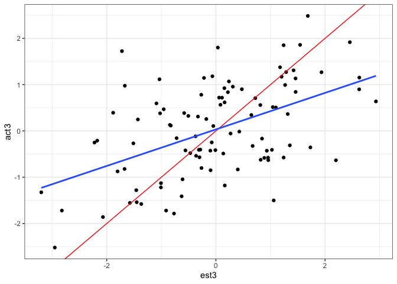<!-- -->

## Prepare for Regression

### MFPCA for Y

``` r
Y_miss = irregMFPCA::missing_data_simulator(n_obs = 90,
                                            dat = Y,
                                            t = seq(0, 1, length.out = TT),
                                            seed = 16)
df_y = Y_miss %>% tibble_format(tindex = seq(0, 1, length.out = 100)) %>% fpca_format()
#> New names:
#> • `v` -> `v...3`
#> • `v` -> `v...4`

res1_y = FPCA(df_y$Component1,
            df_y$Time,
            list(dataType='Sparse',
                 error=FALSE,
                 kernel='epan',
                 verbose=TRUE))
#> No binning is needed!
#> 
#> At most 33 number of PC can be selected, thresholded by `maxK` = 20.

res2_y = FPCA(df_y$Component2,
            df_y$Time,
            list(dataType='Sparse',
                 error=FALSE,
                 kernel='epan',
                 verbose=TRUE))
#> No binning is needed!
#> 
#> At most 30 number of PC can be selected, thresholded by `maxK` = 20.

mfpca_resy = irregMFPCA::irregMFPCA(components = 3,
                                    split = F,
                                    res1_y,
                                    res2_y)
```

### Multivariate Multiple Regression

``` r
response = mfpca_resy$rho
predictor = mfpca_res$rho

mod = lm(response ~ -1 + predictor)

t(B); mod$coefficients
#>      [,1] [,2] [,3]
#> [1,]   -1    2    3
#> [2,]   -1   -9    3
#> [3,]    5    5   -3
#>                   [,1]        [,2]        [,3]
#> predictor1  -2.5776349 -4.50640527 -0.03887905
#> predictor2 -10.7831754  1.25997067 -0.07204123
#> predictor3  -0.4600562 -0.05932575  2.44074174
```
