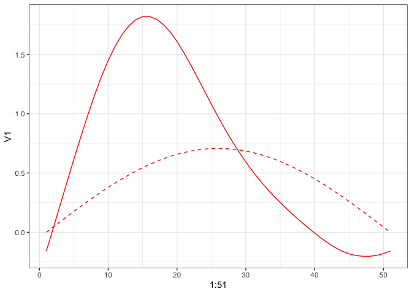
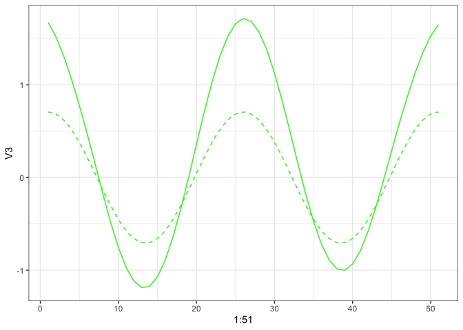
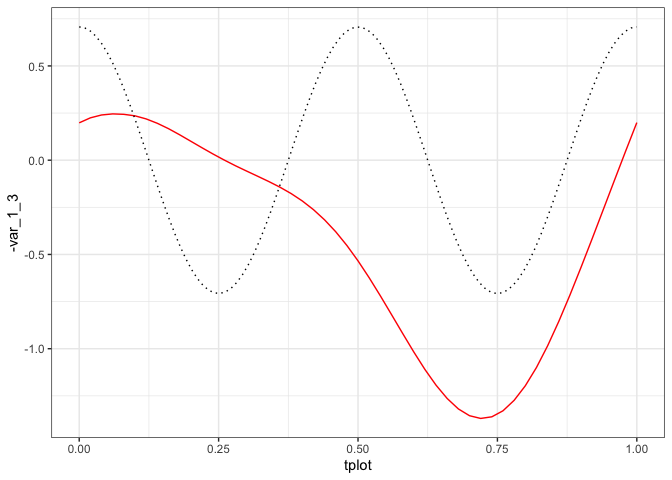

alternative_simulation
================

``` r
library(irregMFPCA)
library(tidyverse)
library(fda)
library(fdapace)
library(MFPCA)
set.seed(16)
```

## Generate Mean Functions

$$
\mu_{X_1}(t) = -2(t-0.5)^2 + 5 \text{ for }t \in [0,1]
$$

$$
\mu_{X_2}(t) = 3(t-0.75)^3 + 0.1 \text{ for }t \in [0,1]
$$

``` r
TT = 100
t = seq(0, 1, length.out = TT)
mu_X1 = -2*(t-0.5)^2 + 5
mu_X2 = 3*(t-0.75)^3 + 0.1
```

## Generate Eigenfunctions and Eigenscores

$$
\phi^{X_1}_1(t) = \sqrt{2}\sin(\pi t), \ \phi^{X_1}_2(t) = \sqrt{2}\sin(7\pi t), \ \phi^{X_1}_3(t) = \sqrt{2}\cos(7\pi t) 
$$

$$
\phi^{X_2}_1(t) = \sqrt{2}\cos(5\pi t), \ \phi^{X_2}_2(t) = \sqrt{2}\cos(\pi t), \ \phi^{X_2}_3(t) = \sqrt{2}\sin(7\pi t) 
$$

``` r
phi_X1 = matrix(0, nrow = TT, ncol = 3)
phi_X1[,1] = sqrt(2/TT)*sin(pi*t)
phi_X1[,2] = sqrt(2/TT)*sin(7*pi*t)
phi_X1[,3] = sqrt(2/TT)*cos(7*pi*t)

n = 99
lambda11 = 40; lambda21 = 10; lambda31 = 1
xi_X1 = matrix(0, nrow = n, ncol = 3)
xi_X1[,1] = rnorm(n, 0, lambda11)
xi_X1[,2] = rnorm(n, 0, lambda21)
xi_X1[,3] = rnorm(n, 0, lambda31)

X1 = t(phi_X1 %*% t(xi_X1)) + rep(mu_X1, n) #TODO: Check this line; slightly different generation

phi_X1 %>%
  as.data.frame() %>%
  ggplot(aes(x = t)) +
  geom_line(aes(y = V1), col = "red") +
  geom_line(aes(y = V2), col = "blue") +
  geom_line(aes(y = V3), col = "green") +
  theme_bw()
```

<!-- -->

``` r

plot(mu_X1)
```

<!-- -->

``` r

phi_X2 = matrix(0, nrow = TT, ncol = 3)
phi_X2[,1] = sqrt(2/TT)*cos(5*pi*t)
phi_X2[,2] = sqrt(2/TT)*cos(pi*t)
phi_X2[,3] = sqrt(2/TT)*sin(7*pi*t)

# lambda12 = 2; lambda22 = 20; lambda32 = 50
# xi_X2 = matrix(0, nrow = n, ncol = 3)
# xi_X2[,1] = rnorm(n, 0, lambda12)
# xi_X2[,2] = rnorm(n, 0, lambda22)
# xi_X2[,3] = rnorm(n, 0, lambda32)

X2 = t(phi_X2 %*% t(xi_X1)) + rep(mu_X2, n)

phi_X2 %>%
  as.data.frame() %>%
  ggplot(aes(x = t)) +
  geom_line(aes(y = V1), col = "red") +
  geom_line(aes(y = V2), col = "blue") +
  geom_line(aes(y = V3), col = "green") +
  theme_bw()
```

<!-- -->

``` r

plot(mu_X2)
```

<!-- -->

## Generate Response

$$
\mu_{Y_1}(t) = 6\exp(-(t-1)^2)
$$

$$
\mu_{Y_2}(t) = -2\cdot 14^{(t-0.5)}
$$

$$
\phi^{Y_1}_1(t) = \sqrt{2}\cos(9\pi t), \ \phi^{Y_1}_2(t) = \sqrt{2}\sin(5\pi t), \ \phi^{Y_1}_3(t) = \sqrt{2}\cos(2\pi t)
$$

$$
\phi^{Y_2}_1(t) = \sqrt{2}\sin(3\pi t), \ \phi^{Y_2}_2(t) = \sqrt{2}\cos(\pi t), \ \phi^{Y_2}_3(t) = \sqrt{2}\sin(7\pi t)
$$

``` r
mu_Y1 = 6*exp(-(t-1)^2)
mu_Y2 = -2*14^(t-0.5)

phi_Y1 = matrix(0, nrow = TT, ncol = 3)
phi_Y1[,1] = sqrt(2/TT)*cos(9*pi*t)
phi_Y1[,2] = sqrt(2/TT)*sin(5*pi*t)
phi_Y1[,3] = sqrt(2/TT)*cos(2*pi*t)

phi_Y1 %>%
  as.data.frame() %>%
  ggplot(aes(x = t)) +
  geom_line(aes(y = V1), col = "red") +
  geom_line(aes(y = V2), col = "blue") +
  geom_line(aes(y = V3), col = "green") +
  theme_bw()
```

<!-- -->

``` r

plot(mu_Y1)
```

<!-- -->

``` r

xi_Y1 = matrix(0, nrow = n, ncol = 3)
xi_Y1[,1] = rnorm(n, 0, lambda11)
xi_Y1[,2] = rnorm(n, 0, lambda21)
xi_Y1[,3] = rnorm(n, 0, lambda31)


phi_Y2 = matrix(0, nrow = TT, ncol = 3)
phi_Y2[,1] = sqrt(2/TT)*sin(3*pi*t)
phi_Y2[,2] = sqrt(2/TT)*cos(pi*t)
phi_Y2[,3] = sqrt(2/TT)*sin(7*pi*t)

phi_Y2 %>%
  as.data.frame() %>%
  ggplot(aes(x = t)) +
  geom_line(aes(y = V1), col = "red") +
  geom_line(aes(y = V2), col = "blue") +
  geom_line(aes(y = V3), col = "green") +
  theme_bw()
```

<!-- -->

``` r

plot(mu_Y2)
```

<!-- -->

``` r

# xi_Y2 = matrix(0, nrow = n, ncol = 3)
# xi_Y2[,1] = rnorm(n, 0, lambda12)
# xi_Y2[,2] = rnorm(n, 0, lambda22)
# xi_Y2[,3] = rnorm(n, 0, lambda32)
```

## Combine Components

``` r
X = cbind(X1, X2)
phi_X = cbind(phi_X1, phi_X2)
# xi_X = cbind(xi_X1, xi_X2)

phi_Y = cbind(phi_Y1, phi_Y2)
# xi_Y = cbind(xi_Y1, xi_Y2)
mu_Y = c(mu_Y1, mu_Y2)
```

## Noise

``` r
sigma = 0.1
n_eig_X = 3
n_eig_Y = 3
```

## Regression

``` r
# Generate B matrix from Unif(-U, U)
U = 3
B = matrix(sample(seq(-U, U, 0.01),n_eig_X*n_eig_Y),
           nrow = n_eig_Y,
           ncol = n_eig_X)

epsilon = matrix(rnorm(n_eig_Y*n, mean = 0, sd = 0.01), 
                 n_eig_Y, 
                 n)

Y1 = matrix(nrow = n, 
            ncol = TT)
Y2 = matrix(nrow = n, 
            ncol = TT)
```

### Introduce Outliers

``` r
outliers = 20
non_outliers = n - outliers

for (i in 1:non_outliers){
  Y1[i,] = t(B%*%xi_X1[i,])%*%t(phi_Y1) + mu_Y1 + t(phi_Y1%*%epsilon[,i])
  Y2[i,] = t(B%*%xi_X1[i,])%*%t(phi_Y2) + mu_Y2 + t(phi_Y2%*%epsilon[,i])
}
```

## Scenarios

``` r
scenario = 1

if (scenario==1){
  outlier_var = 0.5
  B_out = B + matrix(rnorm(n_eig_X*n_eig_Y, mean = 0, sd = outlier_var),
                     nrow = n_eig_Y,
                     ncol = n_eig_X)
  
  for (i in (non_outliers+1):n){
    Y1[i,] = t(B_out%*%xi_X1[i,])%*%t(phi_Y1) + mu_Y1 + t(phi_Y1%*%epsilon[,i])
    Y2[i,] = t(B_out%*%xi_X1[i,])%*%t(phi_Y2) + mu_Y2 + t(phi_Y2%*%epsilon[,i])
  }
}

# if (scenario==2){
#   gaittime = seq(0, 1, len=TT)
#   gaitrange = c(0,1)
#   nord = 10
#   gaitbasis = create.bspline.basis(c(0,1), nbasis = nord, norder = 3)
#   evaluated_basis = eval.basis(gaitbasis, gaittime)
#   normalised_basis = eval.basis(gaitbasis, gaittime)
#   
#   values = diag(inprod(gaitbasis,gaitbasis)*TT)
#   intu = sample(nord, 1)
#   
#   out_basis = normalised_basis[, intu]
#   
#   B_out = rbind(B, rnorm(3,3,1))
#   
#   for (i in (non_outliers+1):n){
#     Y[i,] = t(cbind(phi_Y, out_basis/values[intu]) %*% (B_out %*% xi_X[i,]) + mu_Y) + t(phi_Y%*%epsilon[,i])
#   }
# }

Y = cbind(Y1, Y2)
```

``` r
E = matrix(rnorm(2*TT*n, mean = 0, sd = sigma), n, 2*TT)

Y =  Y + E
X.all = X + E
```

``` r
#### plot Predictior and Response curves ####

matplot(t(X.all), 
        type='l', 
        ylab='X(t)', 
        xlab='time', 
        main='Plot of predictor curves', 
        col=rgb(0,0,0,alpha=0.4))
matlines(t(X.all[(non_outliers+1):n,]), 
         type='l', 
         lwd=3, 
         lty=1)
```

<!-- -->

``` r

matplot(t(Y), 
        type='l', 
        ylab='Y(t)', 
        xlab='time', 
        main='Plot of response curves', 
        col=rgb(0,0,0,alpha=0.6))
matlines(t(Y[(non_outliers+1):n,]), 
         type='l', 
         lwd=3, 
         lty=1)
```

<!-- -->

### MFPCA

``` r
X_miss = irregMFPCA::missing_data_simulator(n_obs = 40,
                                            dat = X.all,
                                            t = seq(0, 1, length.out = TT),
                                            seed = 16)


df = X_miss %>% tibble_format(tindex = t) %>% fpca_format()
#> New names:
#> • `v` -> `v...3`
#> • `v` -> `v...4`
```

``` r
res1 = FPCA(df$Component1,
            df$Time,
            list(dataType='Sparse',
                 error=FALSE,
                 kernel='epan',
                 verbose=TRUE))
#> No binning is needed!
#> At most 27 number of PC can be selected, thresholded by `maxK` = 20.

res2 = FPCA(df$Component2,
            df$Time,
            list(dataType='Sparse',
                 error=FALSE,
                 kernel='epan',
                 verbose=TRUE))
#> No binning is needed!
#> At most 34 number of PC can be selected, thresholded by `maxK` = 20.
```

``` r
# plot(res)
```

### Compare to Actual: First Component

``` r
act = data.frame(act1 = mu_X1,
                 act2 = mu_X2)
hat = data.frame(hat1 = res1$mu,
                 hat2 = res2$mu)

hat %>%
  ggplot() +
  geom_line(aes(x = 1:51, y = hat1)) +
  geom_line(data = act, aes(x = seq(1, 51, length.out = 100), y = act1), linetype = "dashed") +
  theme_bw()
```

<!-- -->

``` r

phi_X1_df = phi_X1 %>% as.data.frame()

res1$phi[, 1:3] %>%
  as.data.frame() %>%
  ggplot() +
  geom_line(aes(x = 1:51, y = V1), col = "red") +
  geom_line(data = phi_X1_df, aes(x = seq(1, 51, length.out = 100), y = V1), col = "red", linetype = "dashed") +
  theme_bw()
```

<!-- -->

``` r

res1$phi[, 1:3] %>%
  as.data.frame() %>%
  ggplot() +
  geom_line(aes(x = 1:51, y = V2), col = "blue") +
  geom_line(data = phi_X1_df, aes(x = seq(1, 51, length.out = 100), y = V2), col = "blue", linetype = "dashed") +
  theme_bw()
```

<!-- -->

``` r

res1$phi[, 1:3] %>%
  as.data.frame() %>%
  ggplot() +
  geom_line(aes(x = 1:51, y = V3), col = "green") +
  geom_line(data = phi_X1_df, aes(x = seq(1, 51, length.out = 100), y = V3), col = "green", linetype = "dashed") +
  theme_bw()
```

<!-- -->

### Compare to Actual: Second Component

``` r
hat %>%
  ggplot() +
  geom_line(aes(x = 1:51, y = hat2)) +
  geom_line(data = act, aes(x = seq(1, 51, length.out = 100), y = act2), linetype = "dashed") +
  theme_bw()
```

<!-- -->

``` r

phi_X2_df = phi_X2 %>% as.data.frame()

res2$phi[, 1:3] %>%
  as.data.frame() %>%
  ggplot() +
  geom_line(aes(x = 1:51, y = V1), col = "red") +
  geom_line(data = phi_X2_df, aes(x = seq(1, 51, length.out = 100), y = V1), col = "red", linetype = "dashed") +
  theme_bw()
```

<!-- -->

``` r

res2$phi[, 1:3] %>%
  as.data.frame() %>%
  ggplot() +
  geom_line(aes(x = 1:51, y = V2), col = "blue") +
  geom_line(data = phi_X2_df, aes(x = seq(1, 51, length.out = 100), y = V2), col = "blue", linetype = "dashed") +
  theme_bw()
```

<!-- -->

``` r

res2$phi[, 1:3] %>%
  as.data.frame() %>%
  ggplot() +
  geom_line(aes(x = 1:51, y = V3), col = "green") +
  geom_line(data = phi_X2_df, aes(x = seq(1, 51, length.out = 100), y = V3), col = "green", linetype = "dashed") +
  theme_bw()
```

<!-- -->

## Irregular MFPCA

``` r
mfpca_res = irregMFPCA::irregMFPCA(components = 2,
                                   split = F,
                                   res1,
                                   res2)
```

### Check Results

``` r
mfpca_eigenf = mfpca_res$unstackpsi
colnames(mfpca_eigenf) = c("component_1_1", "component_1_2", "component_2_1", "component_2_2")
mfpca_eigens = mfpca_res$rho
colnames(mfpca_eigens) = c("function_1", "function_2")
```

``` r
t = seq(0, 1, length.out = 51)
mfpca_eigenf %>%
  as.data.frame() %>%
  ggplot() +
  geom_line(aes(x = t, y = component_1_1), col = "red", linetype = "dotted") +
  geom_line(data = phi_X1_df, aes(x = seq(0, 1, length.out = 100), y =V1), col = "black") +
  theme_bw()
```

<!-- -->

``` r

mfpca_eigenf %>%
  as.data.frame() %>%
  ggplot() +
  geom_line(aes(x = t, y = component_1_2), col = "red", linetype = "dotted") +
  geom_line(data = phi_X1_df, aes(x = seq(0, 1, length.out = 100), y =V2), col = "black") +
  theme_bw()
```

<!-- -->

``` r


mfpca_eigenf %>%
  as.data.frame() %>%
  ggplot() +
  geom_line(aes(x = t, y = component_2_1), col = "blue", linetype = "dotted") +
  geom_line(data = phi_X2_df, aes(x = seq(0, 1, length.out = 100), y =V1), col = "black") +
  theme_bw()
```

<!-- -->

``` r

mfpca_eigenf %>%
  as.data.frame() %>%
  ggplot() +
  geom_line(aes(x = t, y = component_2_2), col = "blue", linetype = "dotted") +
  geom_line(data = phi_X2_df, aes(x = seq(0, 1, length.out = 100), y =V2), col = "black") +
  theme_bw()
```

<!-- -->

``` r
mfpca_eigens %>%
  as.data.frame() %>%
  ggplot()+
  geom_line(aes(x = seq(1, 99), y = function_1), col = "red", linetype = "dotted") +
  geom_line(data = as.data.frame(xi_X1), aes(x = seq(1, 99), y = V1), col = "black") +
  theme_bw()
```

<!-- -->

``` r

mfpca_eigens %>%
  as.data.frame() %>%
  ggplot()+
  geom_line(aes(x = seq(1, 99), y = function_2), col = "red", linetype = "dotted") +
  geom_line(data = as.data.frame(xi_X1), aes(x = seq(1, 99), y = V2), col = "black") +
  theme_bw()
```

<!-- -->
